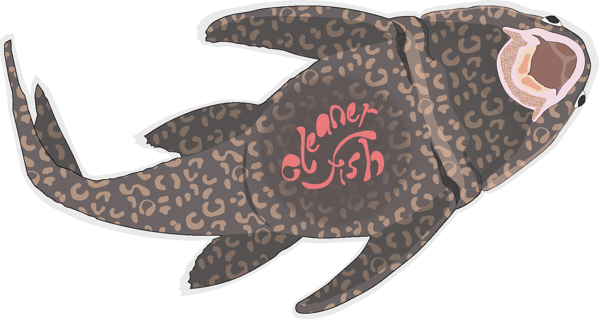
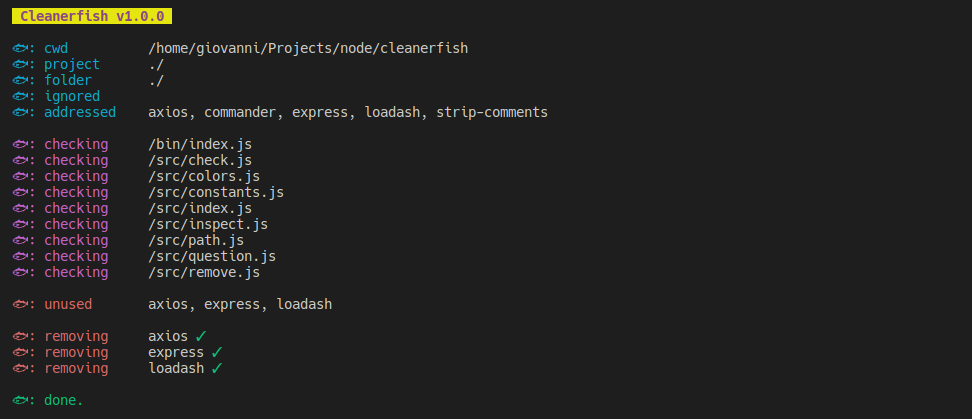
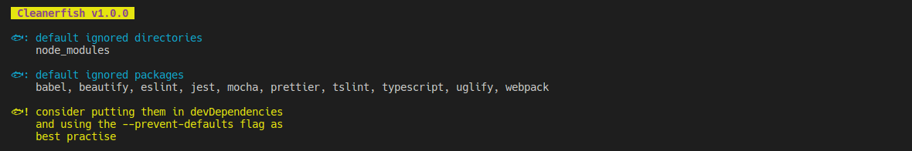

# Cleanerfish
<br>
<p align="center" width="80%" height="auto">
  
</p>

### About Cleanerfish
Cleanerfish is your new favourite utility to **cleanup** your *node.js* projects from **actually unused dependencies**!

Cleanerfish is not the usual boring and ineffective *npm prune*. Insteat it **actually scans your project** to seek dependencies that are not imported/required, but are present in your *package.json* and *node_modules*, then removes them!

Cleanerfish is compatible with both **npm** and **yarn** package managers.

<br>
<p align="center">
  
</p>

### Cleanerfish Installation
```
npm instal -g cleanerfish
```

### Cleanerfish Usage  
#### Safe mode (confirmation required)
```
cleanerfish clean
```

#### Automatic mode (no confirmation required)
```
cleanerfish clean -y
```

#### Different project path
```
cleanerfish clean /path/to/project 
```
#### Inspect specific folder inside the project
```
cleanerfish clean -f /path/to/folder 
```


#### Use yarn instead of npm
```
cleanerfish clean --yarn
```

#### All clean options
```
cleanerfish clean -h

-y, --yes-mode              yes mode (no confirmation required)
-i, --ignore <string>       ignore list of packages (coma-separated)
-p, --folder-path <string>  specify a folder to inspect (must be a sub-folder of the project)
-f, --file <string>         specify a file to inspect (must be inside the project/main folder)
--exclude-dirs <string>     specify a comma-separated list of directories to exclude (must be sub-folder of the project/main folder)
--exclude-files <string>    specify a comma-separated list of files to exclude (must be inside the project/main folder)
-c, --comments              considers commented imports as valid sss(false by default)
-o, --optional              include optionalDependencies (false by default)
-d, --dev                   include devDependencies (false by default)
--prevent-defaults          prevent default ignored packages from being skipped (false by default)
--yarn                      use yarn instead of npm
-h, --help                  display help for command
```
#### List defaults
```
cleanerfish defaults
```
<br>
<p align="center">
  
</p>
