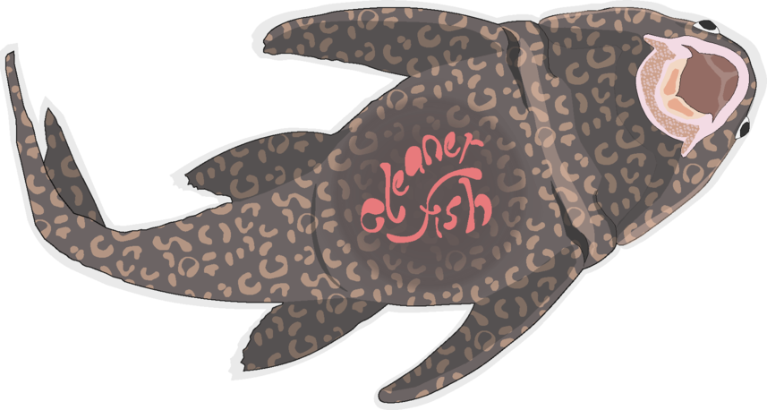
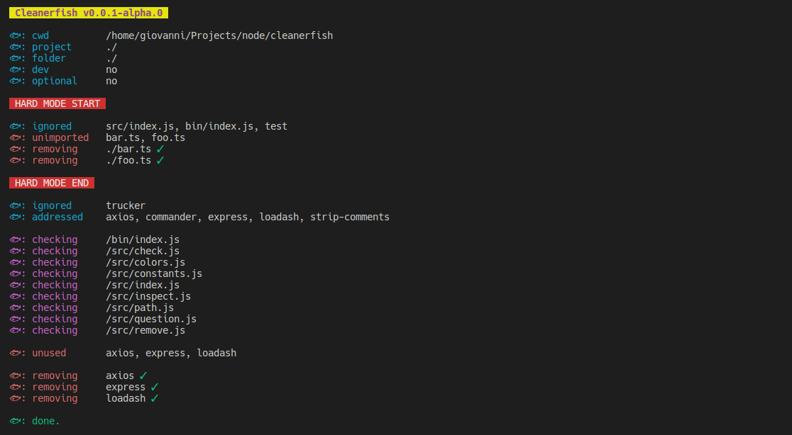
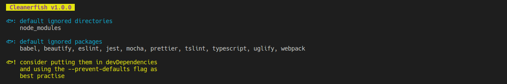

# Cleanerfish

<br>
<p align="center" width="100%"  height="auto">
  
</p>

### About Cleanerfish

Cleanerfish is your new favourite utility to **cleanup** your _node.js_ projects
from **actually unused files and dependencies**!

#### Dependencies

Cleanerfish is not the usual boring and ineffective _npm prune_. Insteat it
**actually scans your project** to seek dependencies that are **not
imported/required**, but are present in your _package.json_ and removes them!

#### Files (hard mode)

Cleanerfish can also scan your project to prune it from all **files that are not
imported/required** in the filnal bundle (_--hard_ or _--hard-only_). Just
remember to always provide the list of entrypoints of your project (usualy not
imported by something else) to prevent Cleanerfish to eat them up too - just use
the _--exclude-hard_ option.

Cleanerfish is compatible with both **npm** and **yarn** package managers and
supports **require**, **import** and **coffeescript** syntaxes.

<br>
<p align="center">
  <p align="center" style="font-size:12px;">A rare picture of Cleanerfish cleaning himself:<p>
  
</p>
<br>

### Cleanerfish Installation

```
npm instal -g cleanerfish
```

### Cleanerfish Usage

**Safe mode (confirmation required)**

```
cleanerfish clean
```

**Automatic mode (no confirmation required)**

```
cleanerfish clean -y
```

**Different project path**

```
cleanerfish clean /path/to/project
```

**Inspect specific folder path inside the project**

```
cleanerfish clean -p /path/to/folder
```

**Use yarn instead of npm**

```
cleanerfish clean --yarn
```

**All clean options**

```
cleanerfish clean -h

-y, --yes-mode              yes mode (no confirmation required)
-i, --ignore <string>       ignore list of packages (coma-separated)
-p, --folder-path <string>  specify a folder to inspect (must be a sub-folder of the project)
-f, --file <string>         specify a file to inspect (must be inside the project/main folder)
--exclude-dirs <string>     specify a comma-separated list of directories to exclude (must be sub-folder of the project/main folder)
--exclude-files <string>    specify a comma-separated list of files to exclude (must be inside the project/main folder)
-c, --comments              considers commented imports as valid (false by default)
-o, --optional              include optionalDependencies (false by default)
-d, --dev                   include devDependencies (false by default)
--prevent-defaults          prevent default ignored packages from being skipped (false by default)
--yarn                      use yarn instead of npm
-h, --help                  display help for command
```

**List defaults**

```
cleanerfish defaults
```

<p align="center">
  
</p>
