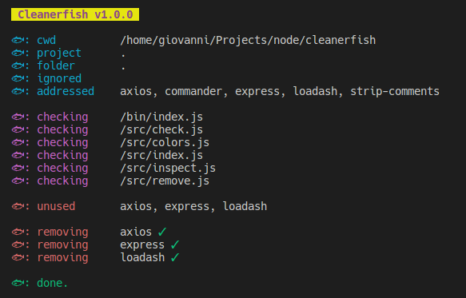

# Cleanerfish

<p align="center">
  
</p>

### About Cleanerfish
Cleanerfish is your new favourite utility to **cleanup** your *node.js* projects from **actually unused dependencies**!

Cleanerfish is not the usual boring and ineffective *npm prune*. Insteat it **actually scans your project** to seek dependencies that are not imported/required, but are present in your *package.json* and *node_modules*, then removes them!

Cleanerfish is compatible with both **npm** and **yarn** package managers.

<p align="center">
  
</p>

### Cleanerfish Installation
```
npm instal -g cleanerfish
```

### Cleanerfish Usage  
#### Safe mode (confirmation required)
```
cleanerfish
```

#### Automatic mode (no confirmation required)
```
cleanerfish -y
```

#### Different project path
```
cleanerfish /path/to/my/project 
```
#### Inspect specific folder
```
cleanerfish -f /path/to/folder 
```


#### Use yarn instead of npm
```
cleanerfish --yarn
```

#### All options
```
-y, --yes-mode            yes mode (no confirmation required)
-i, --ignore <string>     ignore list of packages (coma-separated)
-d, --directory <string>  specify a folder to inspect (must be a sub-folder of the project)
-f, --file <string>       specify a file to inspect (must be inside the project/directory)
--exclude-dirs <string>   specify a coma-separated list of directories to exclude (must be sub-folder of the project/directory)
--exclude-files <string>  specify a coma-separated list of files to exclude (must be inside the project/directory)
-o, --optional            include optionalDependencies
-d, --dev                 include devDependencies
--yarn                    use yarn instead of npm
-h, --help                display help for command
```

